```{r setup, include=FALSE}
# Load packages -----

#install.packages('tidyverse')
#install.packages('countdown')
#install.packages('bibliometrix')


#library(tidyverse)
library(countdown)
#library(bibliometrix)
#biblioshiny()

options(htmltools.dir.version = FALSE)
knitr::opts_chunk$set(
  fig.width=9, fig.height=3.5, fig.retina=3,
  cache = FALSE,
  echo = FALSE,
  message = FALSE, 
  warning = FALSE,
  hiline = TRUE,
  fig.align='center',
  out.width = '75%' 
)


# Link for the Figures
URL = c('https://raw.githubusercontent.com/fabbiocrux/Figures/main/')

```


# Where are we? {.unnumbered background-image="figures/Step-1.jpg" background-size="700px" background-position="100% 50%"}

:::{layout="[30,50]" layout-valign="center"}

- **`PESTEL`** : <br>Analysis of the key external factors
- **`OLAP`** : <br>Refraiming the project

:::


## Pedagogical goal of this afternoon {.unnumbered}

::: {.incremental}

1. 🧠 **Knowledge** : 
   - Use the patent databases to gain a **semantic world of your problematic**. 

1. 🔨 **Know-how** : 
   - Search on pertinent **patent databases** such as **WoS**.

1. ✍**Competence**  : 
   - Be able to make a **landscape visualisation** of patents.
:::

:::{.callout-tip title="🚨 Goal of the Day"}

**Select at least 5 Patents !**

:::

---

Before, We need to understand how **Technology Emergency** is made ...


# Flash Course: Technology Landscape

1. Technology Life Cycles: *Emergence to decline* 
2. Technolology Maturity: *from concepts to artifacts*
3. The Role of Patents


## What is a *technology* ?

. . .

Technology: `Knowledge` + `Artifact` + `Application`

:::{layout="[30,70]" layout-valign="center"}
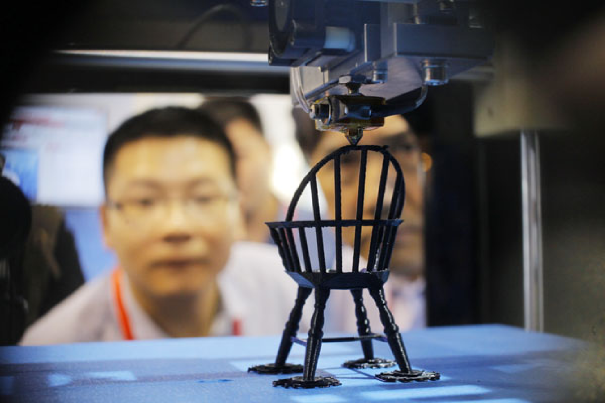{width=50% fig-align='center'}

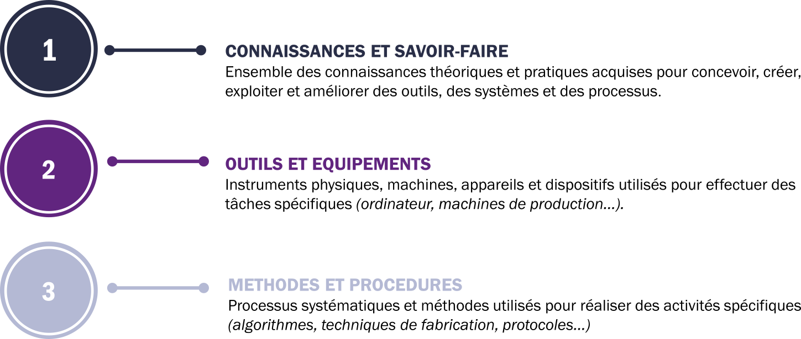{width=50% fig-align='center'}
:::


## Why Study Technology Life Cycles?

:::{layout="[50,50]" layout-align="center"}
:::{}
Key questions:

- 📈 Why do some technologies grow fast and dominate?
- 📉 Why do others disappear?
- 👨‍💻 Can we predict technological substitution?
:::

:::{.fragment}
**Engineering relevance:**

1. R&D strategy
2. Innovation management
3. Investment decisions
4. Career positioning
:::
:::

## Technology Readiness → Maturity {.nostretch}

Analysis Fisher-Pry (Logistic curves: Model S)


:::{layout="[60,-2,40]" layout-valign="center"}

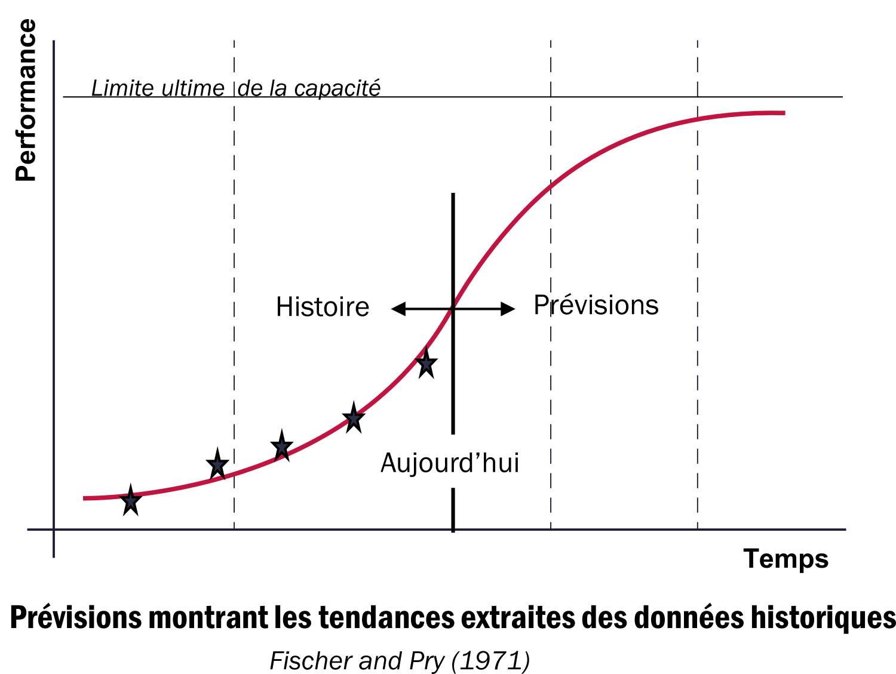{width=60% fig-align='center'}

:::{.fragment}

- Performance vs Time (S-curve)
- Technology substitution (Fisher-Pry)
- Performance as a function of:
     - 💸 Revenue 
     - 🛒 Sells products
     - 📑 Number of Patents
     - 🗂️ Nomber of Publications

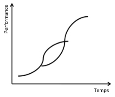{width=300px fig-align='center'}

:::
:::


### Industrial emergence → Modèle STAM

[`Precursor` → `Embryonic` → `Nurture` → `Growth` → `Decline / Substitution`]{.r-fit-text}

:::{layout="[45,-1,65]" layout-valign="center"}

:::{.small}

Phaal, R., O’Sullivan, E., Routley, M., Ford, S., Probert, D., 2011. 
<br>***A framework for mapping industrial emergence***.<br>Technological Forecasting and Social Change 78, 217–230. [https://doi.org/10.1016/j.techfore.2010.06.018](https://doi.org/10.1016/j.techfore.2010.06.018)


:::

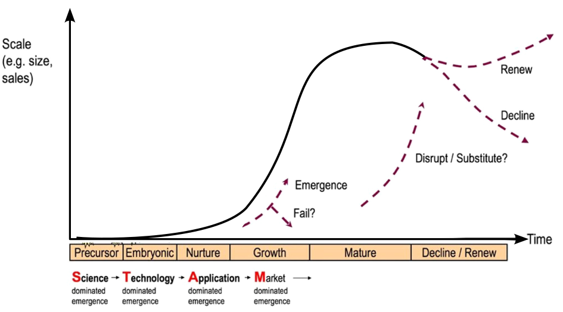{width=100% fig-align='center'}
:::


:::{.footer}
Phaal, R., O’Sullivan, E., Routley, M., Ford, S., Probert, D., 2011. 
<br>A framework for mapping industrial emergence. 
<br>Technological Forecasting and Social Change 78, 217–230. [https://doi.org/10.1016/j.techfore.2010.06.018](https://doi.org/10.1016/j.techfore.2010.06.018)
:::


### Industrial emergence → Modèle STAM

:::{layout="[35,-1,65]" layout-valign="top"}

:::{}

`Precursor`: 'Science'

{width=100% fig-align='center'} 

:::

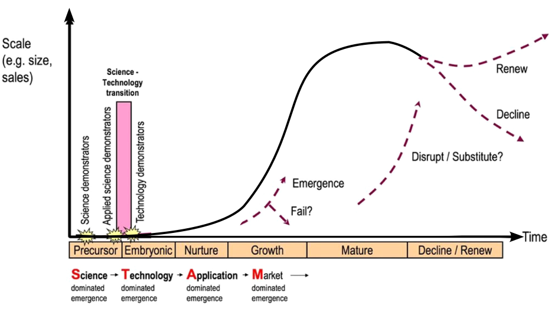{width=800px fig-align='center'}
:::

:::{.footer}
Phaal, R., O’Sullivan, E., Routley, M., Ford, S., Probert, D., 2011. A framework for mapping industrial emergence. 
<br>Technological Forecasting and Social Change 78, 217–230. [https://doi.org/10.1016/j.techfore.2010.06.018](https://doi.org/10.1016/j.techfore.2010.06.018)
:::


### STAM model {background-image="figures/Polymere-00.jpg" background-size="500px" background-position="90% 50%"}

:::{layout="[35,-1,65]" layout-valign="top"}

:::{}

`Precursor`: 
{width=100% fig-align='center'} 


::: {.callout-note title="Ex: Plastics"}
The field of **`Plastics`** imply:

- Notion of *polymers*
- Concept of molecular chain.
- Polymerization process.
- **Natural Rubber** Inspiration from nature
- Chemical structures
:::

:::

:::

:::{.footer}

:::


### Industrial emergence → Modèle STAM

:::{layout="[35,-1,65]" layout-valign="top"}

:::{}

`Precursor`:
{width=100% fig-align='center'} 

`Embryonic`: 'Technology'
{width=100% fig-align='center'} 

:::

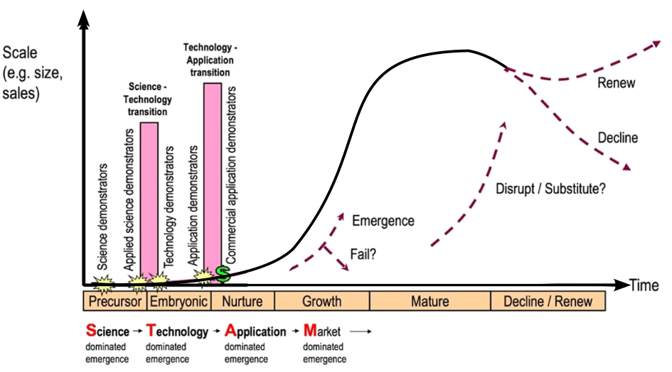{width=100% fig-align='center'}
:::

:::{.footer}
Phaal, R., O’Sullivan, E., Routley, M., Ford, S., Probert, D., 2011. A framework for mapping industrial emergence. 
<br>Technological Forecasting and Social Change 78, 217–230. [https://doi.org/10.1016/j.techfore.2010.06.018](https://doi.org/10.1016/j.techfore.2010.06.018)
:::


###  {background-image="figures/Polymere-01.jpg" background-size="800px" background-position="90% 50%"}

:::{layout="[35,-1,65]" layout-valign="top"}

:::{}

`Precursor`:
{width=100% fig-align='center'} 

`Embryonic`:
{width=100% fig-align='center'} 


::: {.callout-note title="Ex: Vulcanization process"}

Charles Goodyear's discovery of “`vulcanization`” in 1839 made it possible to transform natural rubber into a more durable and elastic material, paving the way for the plastics industry.

:::

:::

:::

:::{.footer}

:::


### Industrial emergence → Modèle STAM

:::{layout="[35,-1,65]" layout-valign="top"}

:::{}

`Precursor`:
{width=100% fig-align='center'} 

`Embryonic`:
{width=100% fig-align='center'} 

`Growth`: 'Aplications'
{width=100% fig-align='center'} 


:::

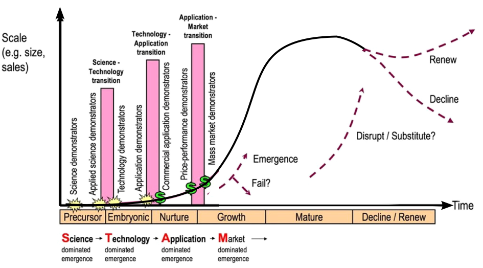{width=100% fig-align='center'}
:::

:::{.footer}
Phaal, R., O’Sullivan, E., Routley, M., Ford, S., Probert, D., 2011. A framework for mapping industrial emergence. 
<br>Technological Forecasting and Social Change 78, 217–230. [https://doi.org/10.1016/j.techfore.2010.06.018](https://doi.org/10.1016/j.techfore.2010.06.018)
:::


###  {background-image="figures/Polymere-02.jpg" background-size="800px" background-position="90% 50%"}

:::{layout="[35,-1,65]" layout-valign="top"}

:::{}

`Precursor`:
{width=100% fig-align='center'} 

`Embryonic`:
{width=100% fig-align='center'} 

`Growth`: 'Market'
{width=100% fig-align='center'} 


::: {.callout-note title="Ex: Produits de la Vulcanisation"}

“`Vulcanization`” → A plethora of new `plastic materials` → Rapid growth of the plastics industry in the 20th century.

:::

:::

:::

:::{.footer}

:::


### Approche de l’émergence industrielle → Modèle STAM

:::{layout="[35,-1,65]" layout-valign="top"}

:::{}

`Precursor`:
{width=100% fig-align='center'} 

`Embryonic`:
{width=100% fig-align='center'} 

`Growth`:
{width=100% fig-align='center'} 

`Maturity`
{width=100% fig-align='center'} 

:::

{width=100% fig-align='center'}
:::

:::{.footer}
Phaal, R., O’Sullivan, E., Routley, M., Ford, S., Probert, D., 2011. A framework for mapping industrial emergence. 
<br>Technological Forecasting and Social Change 78, 217–230. [https://doi.org/10.1016/j.techfore.2010.06.018](https://doi.org/10.1016/j.techfore.2010.06.018)
:::


### Modèle STAM 

:::{layout="[35,-1,65]" layout-valign="top"}

:::{}

`Precursor`:
{width=100% fig-align='center'} 

`Embryonic`:
{width=100% fig-align='center'} 

`Growth`:
{width=100% fig-align='center'} 

`Maturity`
{width=100% fig-align='center'} 


:::

::: {.callout-note title="Ex: L'explosion des produits plastique ..."}
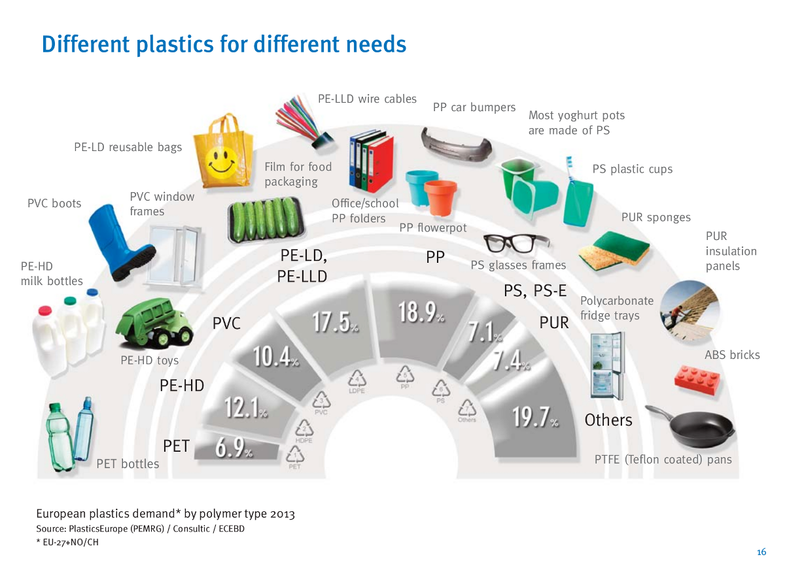{width=100% fig-align='center' } 
:::

:::

### Modèle STAM 

:::{layout="[35,-1,65]" layout-valign="top"}

:::{}


`Precursor`:
{width=100% fig-align='center'} 

`Embryonic`:
{width=100% fig-align='center'} 

`Growth`:
{width=100% fig-align='center'} 

`Maturity`
{width=100% fig-align='center'} 


:::

::: {.callout-note title="Ex: Quelle suite pour le plastique ?"}
Photo by Chris Jordan (2011), an American photographer who has documented the environmental impact of plastic through visually striking works.

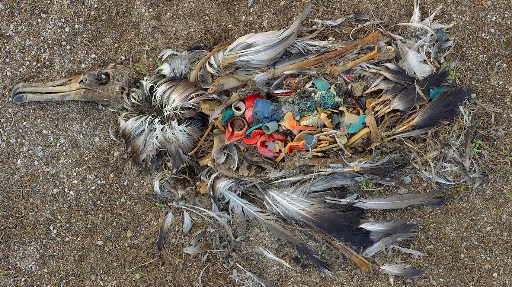{width=100% fig-align='center' } 
:::

:::


## Technology Readiness → Maturity {.nostretch}

The industrial emergence mapping framework.

## Technology Readiness → Levels

Framework developed in the Aeronautical field.

](figures/TRL-00.png)

## Technology Readiness → The Valley of Death

{width="70%" fig-align="center"}

::: footer
Source: [Hensen, J., Loonen, R., Archontiki, M., Kanellis, M., 2015. Using building simulation for moving innovations across the "Valley of Death." REHVA Journal 52, 58--62.](https://www.researchgate.net/profile/Roel-Loonen/publication/276205251_Using_building_simulation_for_moving_innovations_across_the_Valley_of_Death/links/5552333108ae6fd2d81d4406/Using-building-simulation-for-moving-innovations-across-the-Valley-of-Death.pdf)
:::


### `TLR` → Challenges TRL4 - TRL7 {.smaller}

:::{layout="[50,70]" layout-valign="center"}

:::{}

-   There is a **lack of tools** that can provide insights into **technology-integration** issues at an early R&D phase (TRL 1-5).
-   This results in a **mismatch between information** need and availability and **complicates decision-making**.
-   The process requires an **interdisciplinary approach**. The right combination of skills and expertise may not always be available

:::

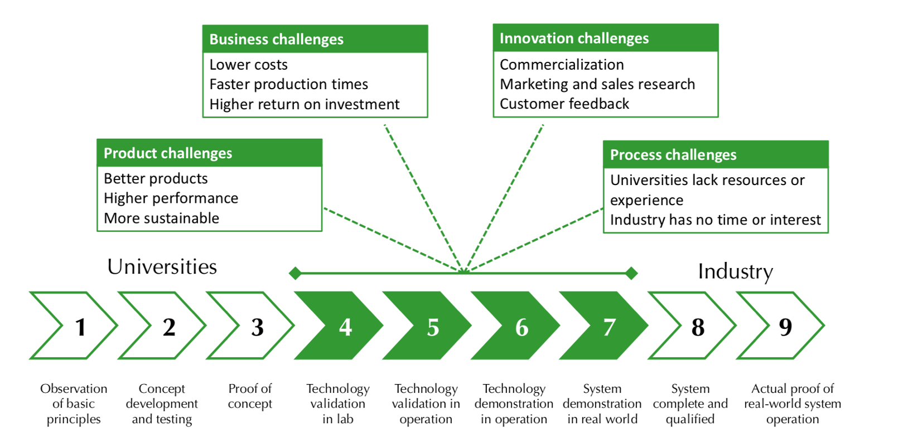{width="100%" fig-align="center"}

:::


::: footer
Source: [Hensen, J., Loonen, R., Archontiki, M., Kanellis, M., 2015. Using building simulation for moving innovations across the "Valley of Death." REHVA Journal 52, 58--62.](https://www.researchgate.net/profile/Roel-Loonen/publication/276205251_Using_building_simulation_for_moving_innovations_across_the_Valley_of_Death/links/5552333108ae6fd2d81d4406/Using-building-simulation-for-moving-innovations-across-the-Valley-of-Death.pdf)
:::


## Le Role of the patents in the industrial emergence

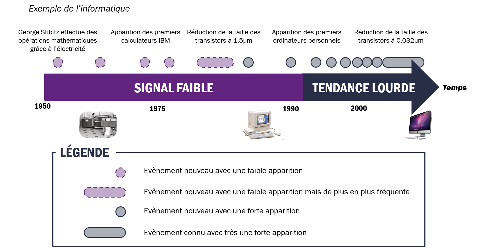{width=100% fig-align='center'}


## Technology Readiness → Evolution

::: {.r-stack}
{width="70%" fig-align="center"}

{.fragment .absolute width="500"  top=250 left=0}

{.fragment width="500" fig-align="center"}

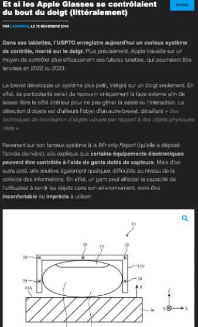{.fragment .absolute top=50 right=50 width="400" }

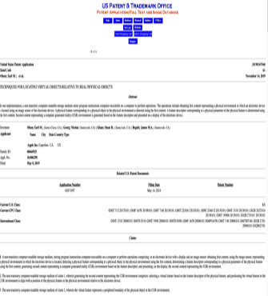{.fragment .absolute top=250 left=0 width="500" }

{.fragment  width="800" fig-align="center"}
:::


## Scientific databases: Web Of Science (WoS)

:::{layout="[30,70]"}
:::{}

{width="95%" fig-align="center"}


::: {.callout-tip}
**Tutorials**

1. [🔑 To Acces to WoS](#wos)

:::
:::

:::{}
- WoS indexes a wide range of academic publications → **peer-reviewed journals**, conference proceedings, patents...
- Citation Tracking → 📈
- Research Analytics → 🏛️🌍
- Curated Content → 📋 Minimal Criteria of indexation
- Interdisciplinary Reach → ⚙️Engineering to 👥 Social Sciences
- Developed by Clarivate → 🔒💰

:::
:::


## Web of science → Scientific & Patent databases

{width="400" fig-align="left"}

::: columns
::: {.column width="50%"}
{fig-align="center"}
:::

::: {.column width="50%"}
{fig-align="center"}
:::
:::


## Pedagogical objective for you!

:::{layout="[45,-5,45]" layout-valign="top"}

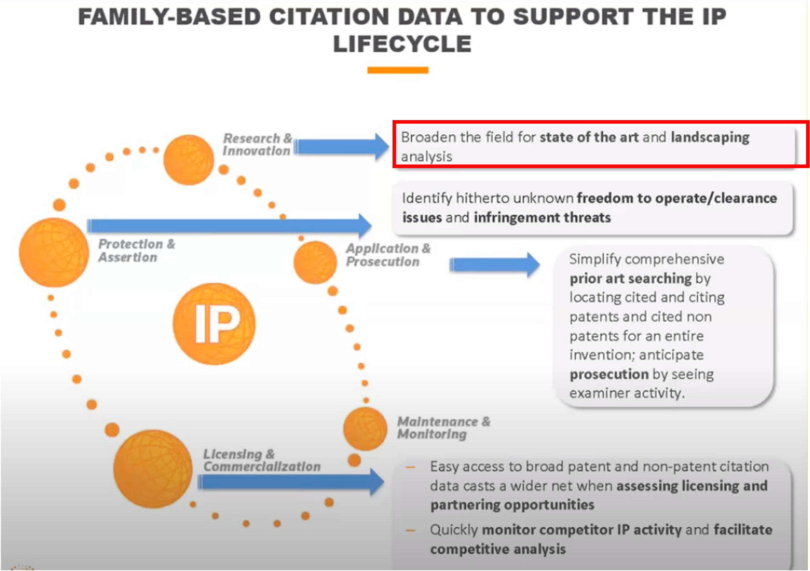{fig-align="center"}

:::{}
An overview on the space of patents enabling :  

- Validating the relevance of your concepts 
- Listing more cited patents 
- Identifying key players (assignees) and links
:::
:::


---

:::{.large}
So..  
:::

{width=50% fig-align=center}


# Presentation of tools

## The canvas of Step 2

::: columns
::: {.column width="30%"}
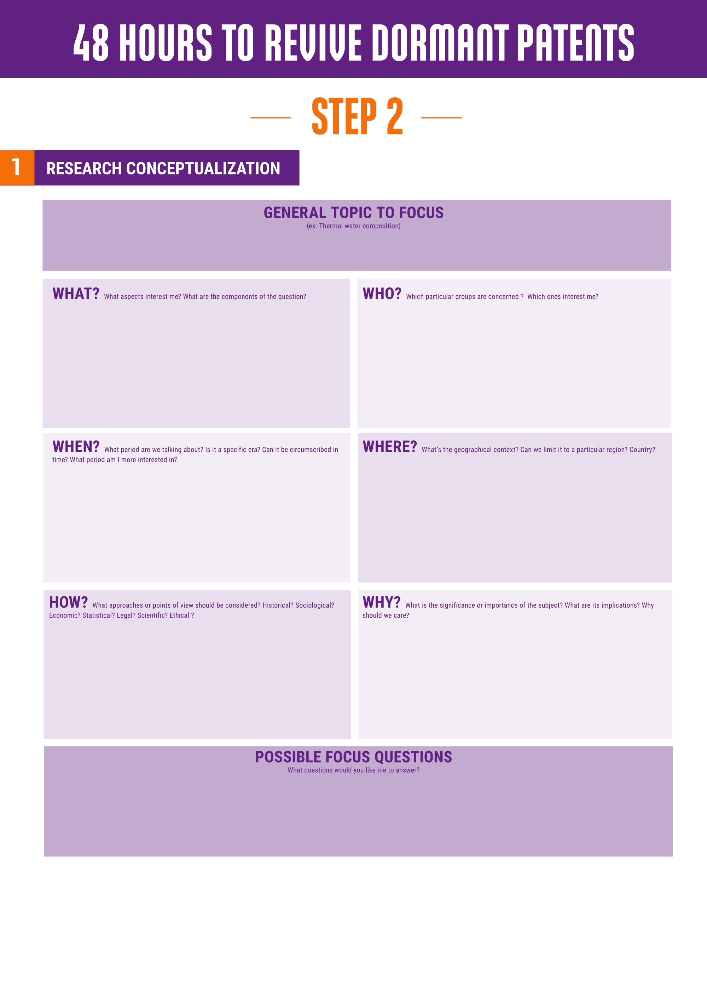{fig-align="center" .lightbox}
:::

::: {.column width="30%"}
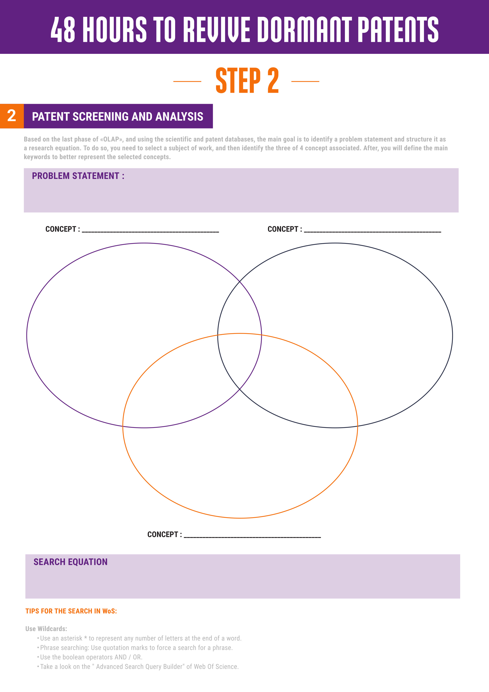{fig-align="center" .lightbox}
:::

::: {.column width="30%"}
{fig-align="center" .lightbox}
:::

:::


## Bibliometric mapping: Vosviewer


:::{layout="[45,-5,45]" layout-valign="top"}

{fig-align="center" .lightbox}


:::{}
[⬇️ Download at <br> https://www.vosviewer.com/](https://www.vosviewer.com/)

::: {.callout-tip}
**Tutorials**

1. [🔑 VOSviewer: First Steps WoS](#sci-vos)

:::
:::

:::


As example


:::{.footer}
Source: [Van Eck, N.J., Waltman, L., 2010. Software survey: VOSviewer, a computer program for bibliometric mapping. Scientometrics 84, 523–538. ](https://doi.org/10.1007/s11192-009-0146-3)
:::


## { background-image="2026/catalina-00.png" background-size="65%" background-position="50% 50%" }


## Axis of work { background-image="2026/catalina-00.png" background-size="65%" background-position="50% 50%" background-opacity="0.1" }

:::{layout="[45,-5,65]" layout-valign="top"}

:::{}
1. Plastics Traceability
1. Improving circularity of multilayer flexible plastic packaging
1. Enhancing ecodesign and upcycling of recycled products
1. Sorting/Collection at local level

:::


{width=100% fig-align=center}


:::

'first come, first served'...


## Step 2a: Research conceptualization

:::{layout="[45,-2,50]" layout-valign="top"}

{fig-align="center" width="80%" .lightbox}

:::{}

**🎯 Goal:**

- Based on the canvas, Identify the **boundaries** of the subject
    - Define two or three specific focus. 


```{r, include=TRUE}
countdown(minutes = 30, seconds = 00, top = 100, right=50, font_size = "4em", padding = "5px",
          margin = "5px",)
```

:::
:::


## Step 2b: Patent screening and analysis

:::{layout="[45,-2,50]" layout-valign="top"}

{fig-align="center" .lightbox}

:::{}
**🎯 Goal:**

- Identify a problem statement
- Define the *Concepts* and '*Semantic world*'. 
- Structure a *replicable search equation* based on the 'Venn Diagram' approach. 

- Use scientific databases [🔗 Web of Science](https://www-webofscience-com.bases-doc.univ-lorraine.fr/wos/woscc/basic-search) 

<br>
<br>
<br>

```{r, include=TRUE}
countdown(minutes = 30, seconds = 00, top = 100, right=50, font_size = "4em", padding = "5px",
          margin = "5px",)
```

:::
:::


## Step 2c: Comparing the scientific and the Patent domains


::: columns
::: {.column width="50%"}
{fig-align="center" .lightbox}
:::

::: {.column width="50%"}


**🎯 Goal:** Facilitate a discussion on the visualizations generated by **VOSviewer**. 

- Interprete the clusters related to the search equation.
- key patterns and connections. 
- Uncover insights among concepts and themes. 
- **Define a focus to find the 5 patents**.


```{r, include=TRUE}
countdown(minutes = 45, seconds = 00, top = 100, right=50, font_size = "4em", padding = "5px",
          margin = "5px",)
```


:::
:::


# List of Tutorials

- [Web Of Science Patent Database](#wos)
- [VOSviewer: Landscape visualization](#sci-vos)


## Example of the Analysis

##  Web Of Science Patent Database {#wos}

##  Web Of Science Patent Database

:::{layout="[50,-2,50]" layout-valign="center"}
:::{}

- 
[🔗 Access to UL <br>`https://ent.univ-lorraine.fr/`](https://ent.univ-lorraine.fr/){target="_blank"}

- Use your UL account to access

:::

{fig-align="center" width="60%"}

:::


### WoS database → Access to the 'Ressources en Ligne'

:::{layout="[40,-2,60]" layout-valign="center"}
:::{}

- Acces to <br> [`Ressources en Ligne`](https://bu.univ-lorraine.fr/ressources-en-ligne){target="_blank"}

- [🔗 Ressources online of the UL](https://bu.univ-lorraine.fr/ressources-en-ligne){target="_blank"}

:::

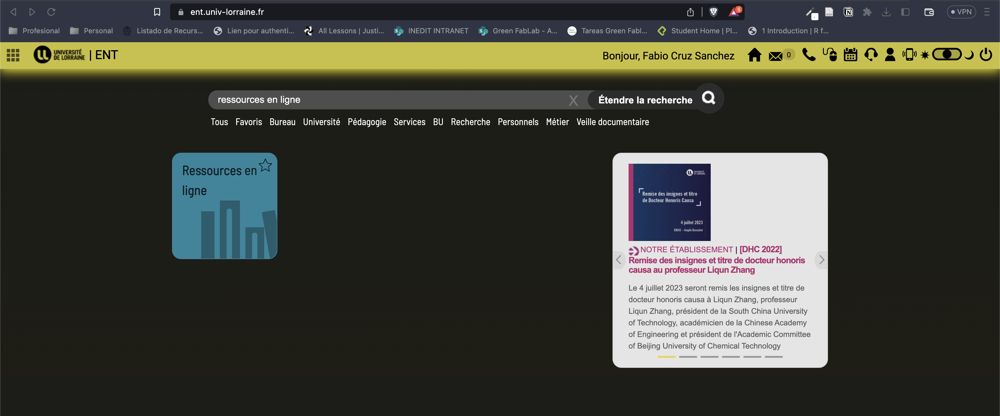

:::


### WoS database → UL Web of Science


:::{layout="[40,-2,60]" layout-valign="center"}
:::{}

- Look for the 'Web of Science' database

- [🔗 Ressources online of the UL](https://bu.univ-lorraine.fr/ressources-en-ligne){target="_blank"}
:::

:::


## Web of Science Interface → Patent collection 

:::{layout="[40,-2,60]" layout-valign="center"}
:::{}

- Select the <br> **`Derwent Innovation Index`**  <br> database

:::
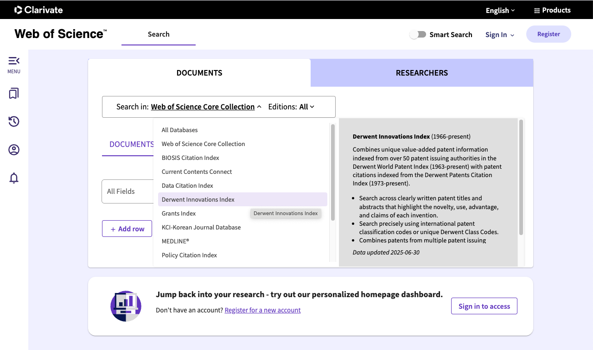
:::


## Web of Science Interface → Simple research mode

:::{layout="[40,-2,60]" layout-valign="center"}
:::{}

- Structure your <br> **`Search Equation`** 

:::
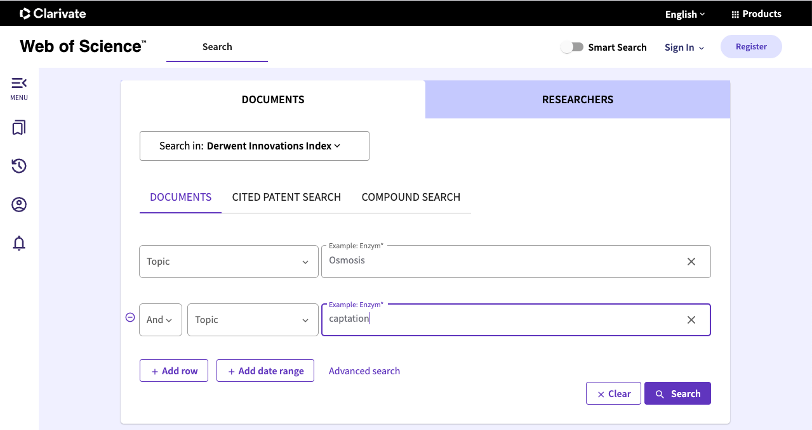
:::


## Web of Science Interface → Results

:::{layout="[40,-2,60]" layout-valign="center"}
:::{}

- See the <br> **`Results`** and **`Filters`**

:::
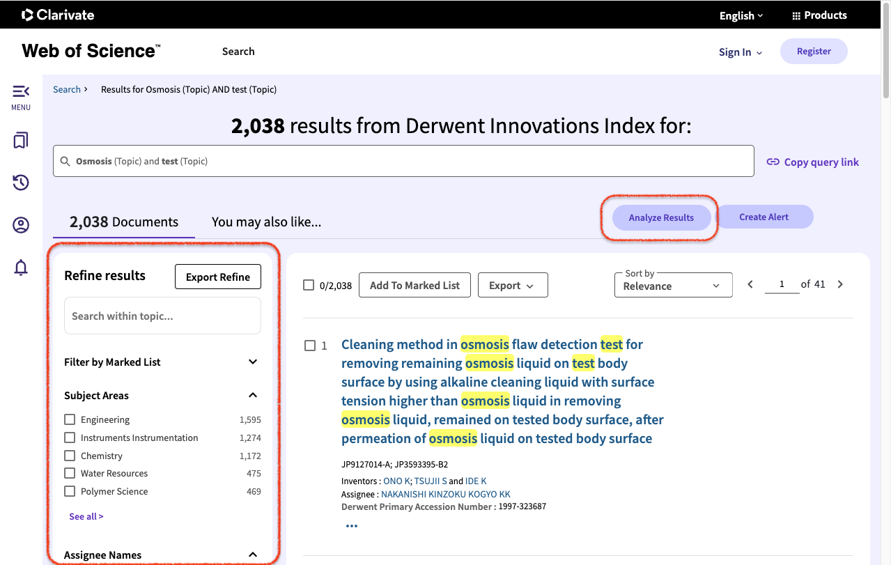
:::


## Web of Science Interface → Analyse Results

:::{layout="[40,-2,60]" layout-valign="center"}
:::{}

- See  <br> **`Analyze Results`**
- Explore the differents visualisation options

   - Subject areas
   - Assignee Names
   - Inventors
   - etc ...


:::
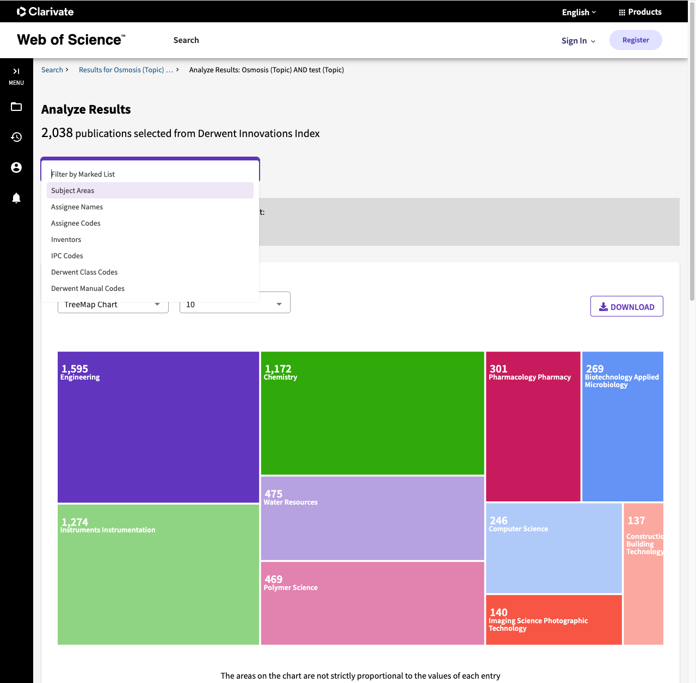
:::


## Web of Science Interface → Export Results

:::{layout="[40,-2,60]" layout-valign="center"}
:::{}

- See  <br> **`Export Results`** → **`Tab Delimited File`**

:::
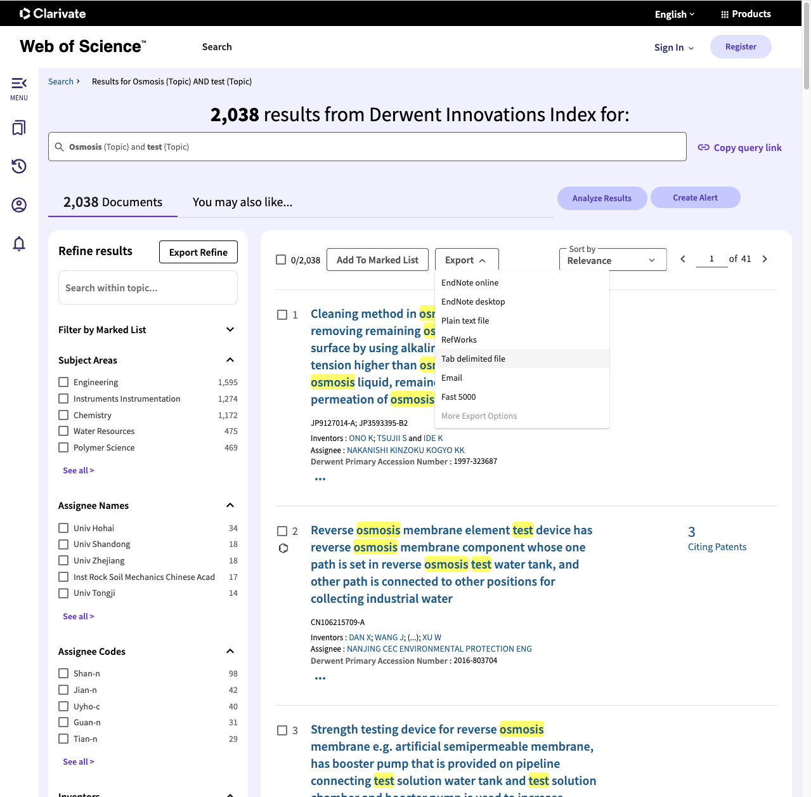
:::


## Web of Science Interface → Sign In

:::{layout="[40,-2,60]" layout-valign="center"}
:::{}

- Make an Account for   <br> **`Web Of Science`** 

:::

:::


## Web of Science Interface → Sign In

:::{layout="[40,-2,60]" layout-valign="center"}
:::{}

- Use your Account to Connect   <br> **`Web Of Science`** 

:::

:::


## Web of Science Interface → Export Results

:::{layout="[40,-2,60]" layout-valign="center"}
:::{}

- See  <br> **`Export Results`** → **`Custom Selection`**

:::
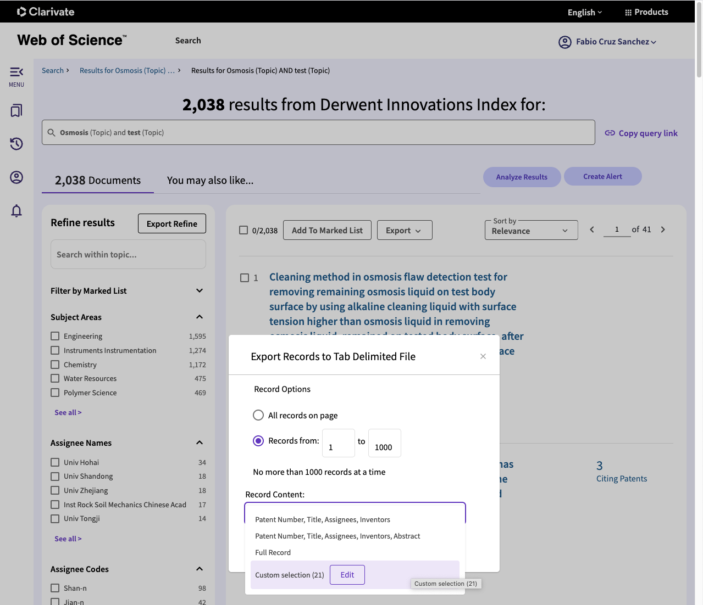
:::


## Web of Science Interface → Export Results

:::{layout="[40,-2,60]" layout-valign="center"}
:::{}

- Select  <br> **`All custom elements`** 

:::
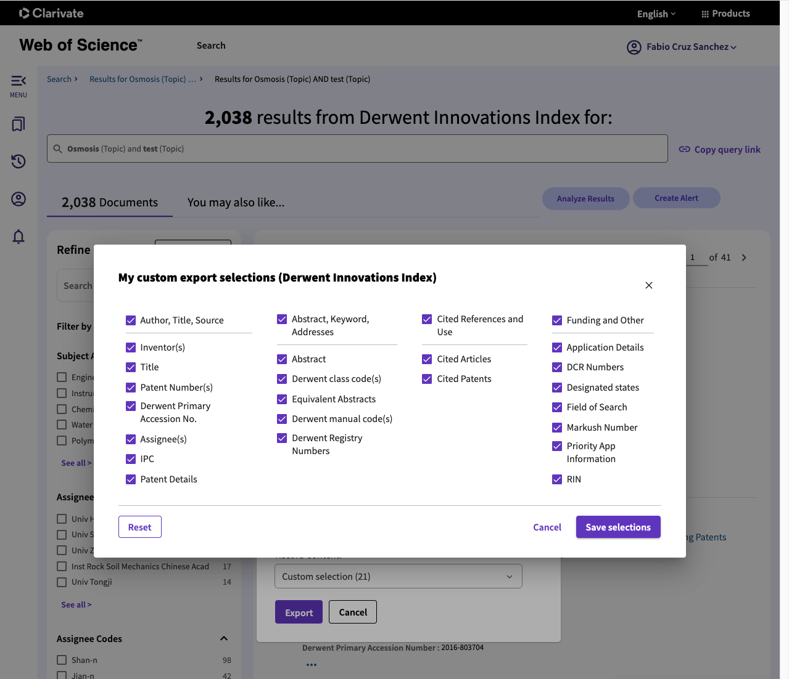
:::


## Web of Science Interface → Export Results

:::{layout="[40,-2,60]" layout-valign="center"}
:::{}

- Make attention to  <br> **`Export the 1 to 1000 Elements max`** 

:::
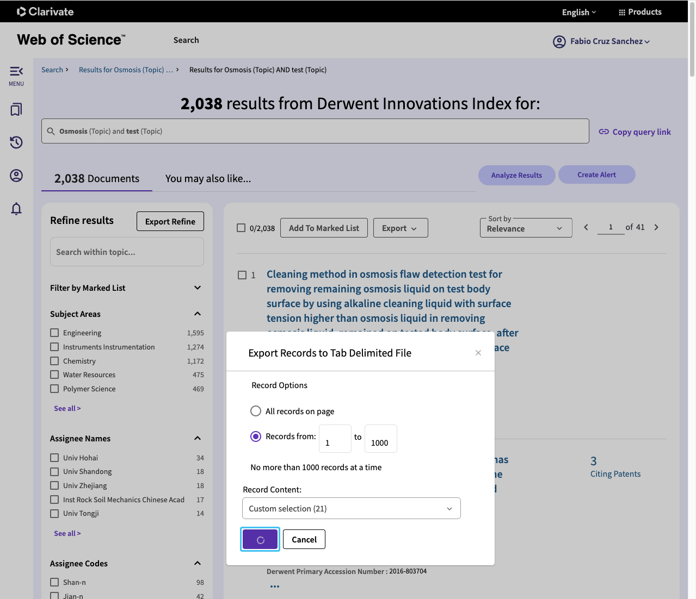
:::


## Web of Science Interface → Download Results

:::{layout="[40,-2,60]" layout-valign="center"}
:::{}

- Download the database <br> **`<Filename.txt>`** 

This is all for this part 🙂
:::
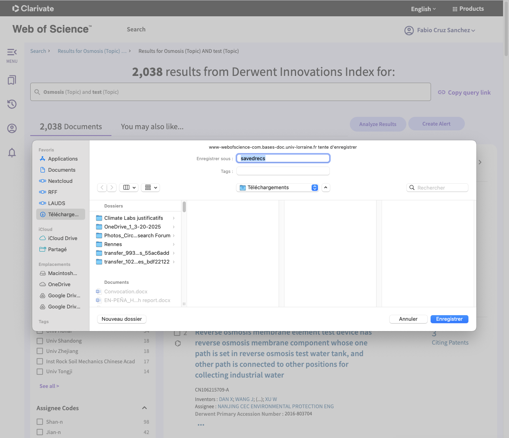
:::


## Web of Science Interface → Filter Patents

:::{layout="[40,-2,60]" layout-valign="center"}
:::{}

- Filter  the Patent based on a <br> **`*Criteria*`** 

:::
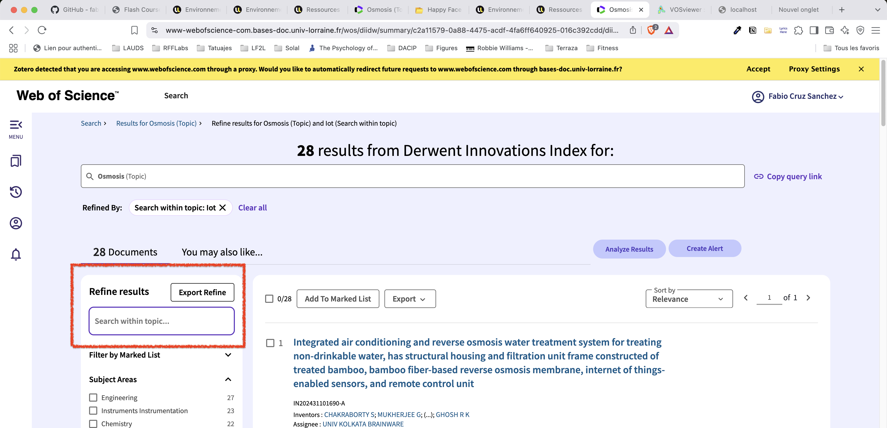
:::


## Vosviewer: <br>Landscape <br> visualization  {#sci-vos .unnumbered background-image="figures/vos/10.jpg" background-size="65%" background-position="100% 50%" }

Scientific Network visualization

⬇️ [https://www.vosviewer.com/](https://www.vosviewer.com/)


## Small introduction to VosViewer

:::{layout="[50,50]"}
:::{}
- Focus on visualization of scientometric networks
- Support for large number of data sources
- Text mining functionality
- Advanced visualization features
- Relatively easy to use
- Limited analysis options
- Developed at CWTS
:::


:::


## Purpose of VOSviewer tool

- 🧠 **Knowledge** : 
   - Use the patent databases to gain a **semantic world of your problematic** based on the **Titles** of the patents.

- ✍**Competence**  : 
   - Be able to make a **landscape visualisation** of set of documents from a research question.

We use the database download from **Web Of Science** 📜

## VOSviewer → First Steps

:::{layout="[40,-2,60]" layout-valign="center"}
:::{}

**🎯 Goal:**

- Load the **`Data`** 
- Create a  **`Visualisation`** 

:::

Analysing *Patents Titles*
:::


## VOSviewer → Load database

:::{layout="[40,-2,60]" layout-valign="center"}
:::{}

- Open VOSviewer on your PC
- Click on **`CREATE`** 
- Add <br> **`Create a Map based on text data`** 

- **`NEXT`** 
:::

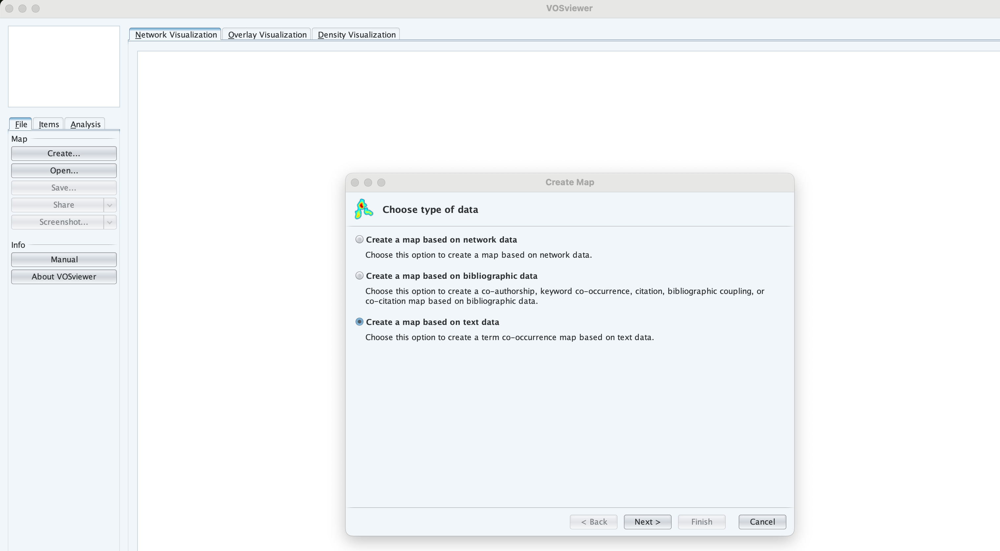
:::

## VOSviewer → Type of database

:::{layout="[40,-2,60]" layout-valign="center"}
:::{}


- Select <br> **`Bibliographic database file`** 

- **`NEXT`** 
:::

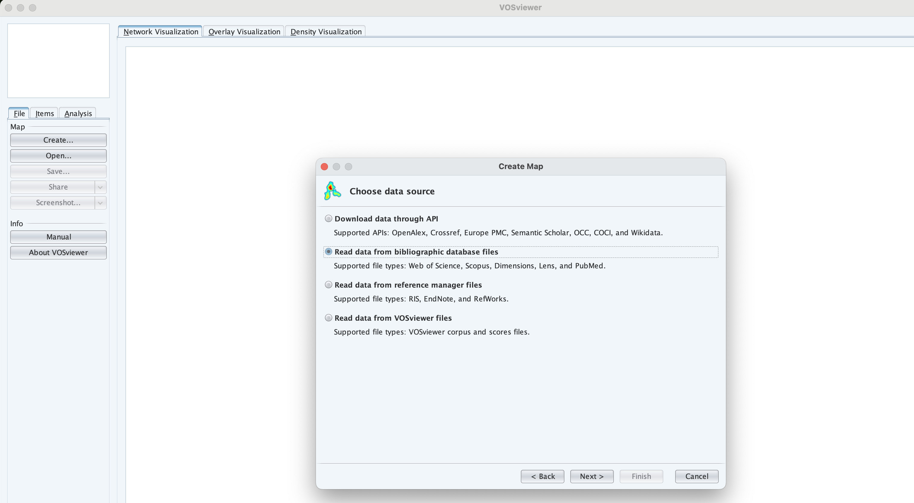
:::

## VOSviewer → Type of database

:::{layout="[40,-2,60]" layout-valign="center"}
:::{}


- Select <br> **`Web Of Science`** 

- Seek your **`<Filename.txt>`**  on your PC 

- **`NEXT`** 
:::

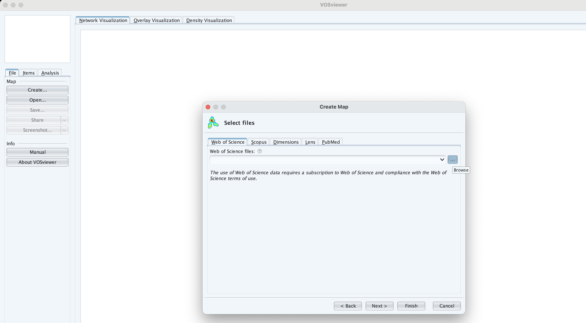
:::

## VOSviewer → Load of database

:::{layout="[40,-2,60]" layout-valign="center"}
:::{}


- Load your **`<Filename.txt>`**  on your PC 

- **`NEXT`** 
:::

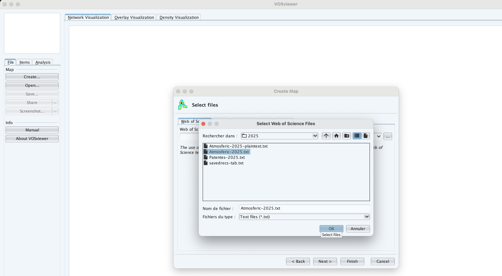
:::


## VOSviewer → Title Field

:::{layout="[40,-2,60]" layout-valign="center"}
:::{}


- Select <br> **`<Title field>`**  

- **`NEXT`** 
:::

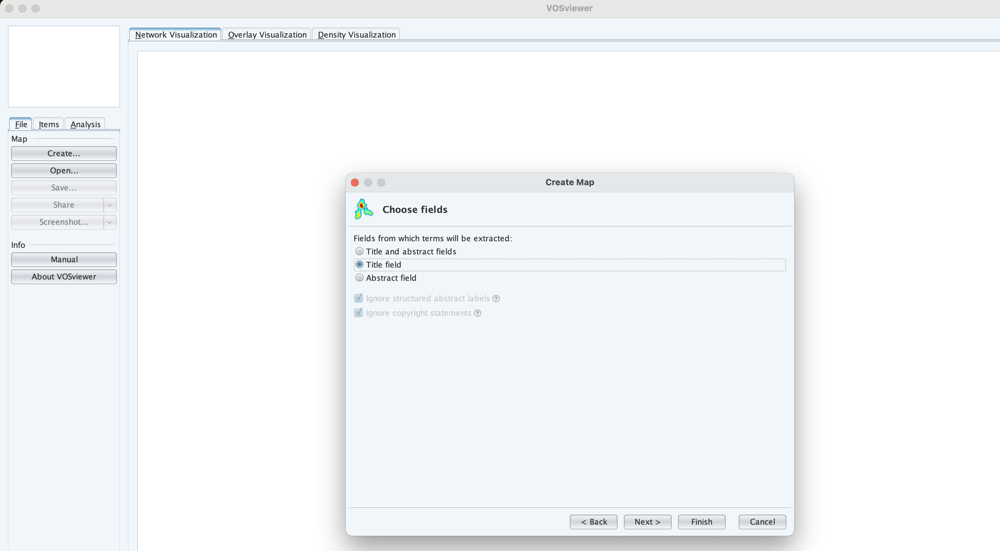
:::


## VOSviewer → Title Field

:::{layout="[40,-2,60]" layout-valign="center"}
:::{}


- Select <br> **`Binary Counting`**  

- **`NEXT`** 
:::

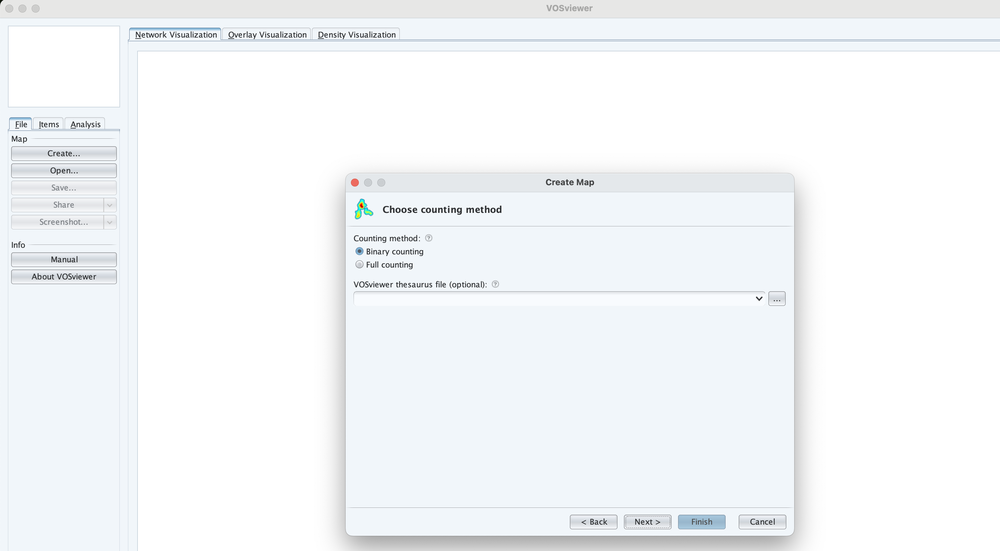
:::


## VOSviewer → Number of Occurences

:::{layout="[40,-2,60]" layout-valign="center"}
:::{}
- Adjuts the <br> **`Number of Occurences`**  

⚠️ Attention to the possible keywords that pass the filter

- **`NEXT`** 
:::

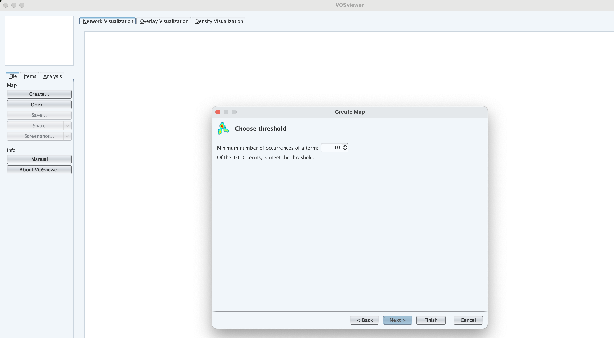
:::


## VOSviewer → Keywords

:::{layout="[40,-2,60]" layout-valign="center"}
:::{}


- Listing of the <br> **`Keywords`**  

⚠️ You can erase `keywords` if neccesary 

- **`NEXT`** 
:::

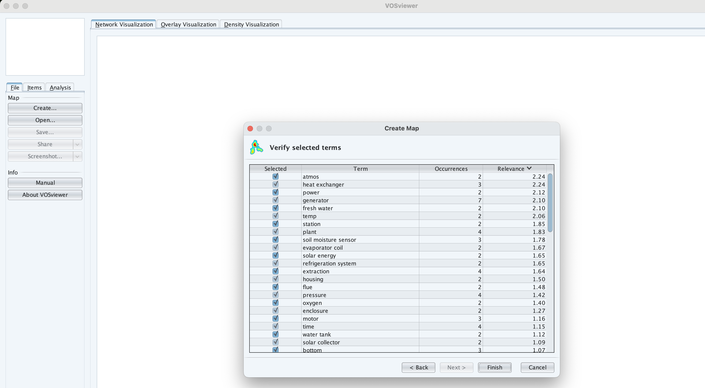
:::


## VOSviewer → Visualization

:::{layout="[40,-2,60]" layout-valign="center"}
:::{}


- Select the <br> **`YES`**  
- **`NEXT`** 

:::

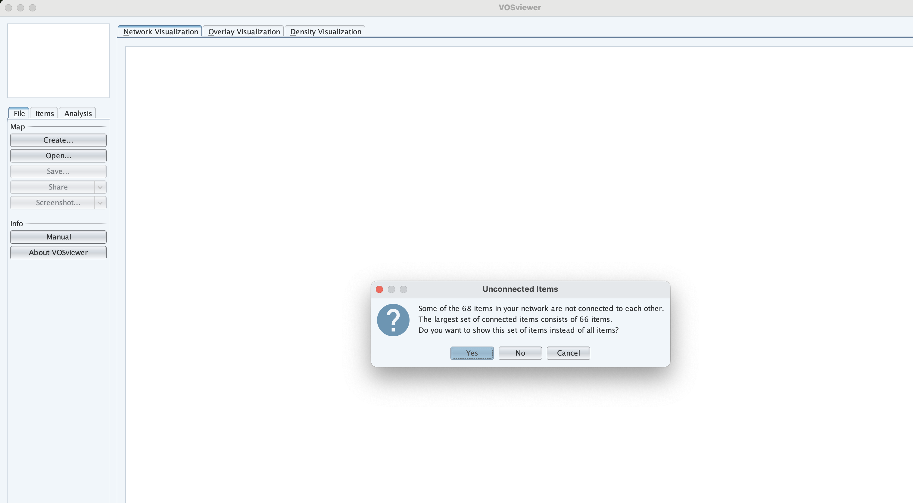
:::


## VOSviewer → Visualization 🙂


:::{layout="[50,-2,50]" layout-valign="top"}
:::{}
**Network Visualization**

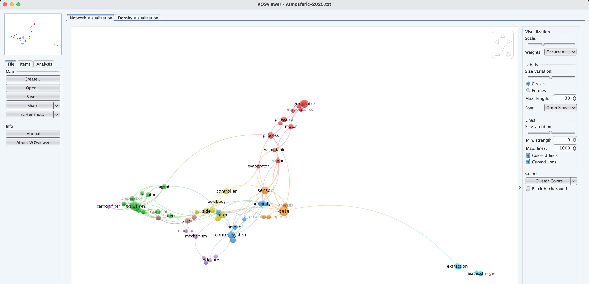
:::

:::{}
**Density Visualization**

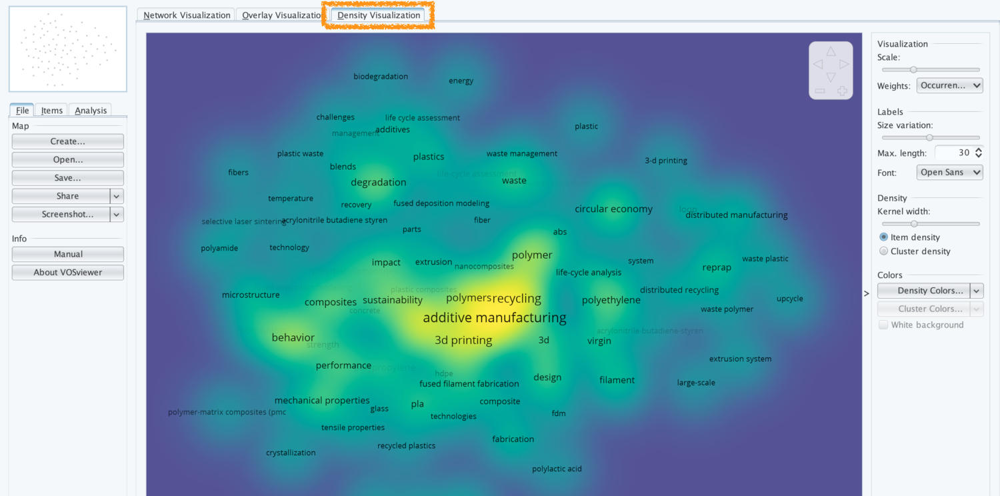
:::

:::


